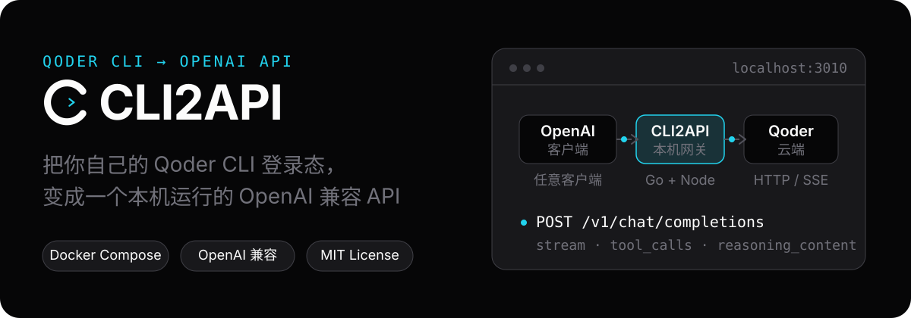
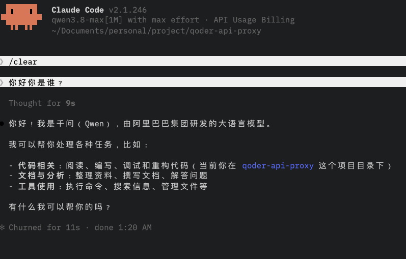
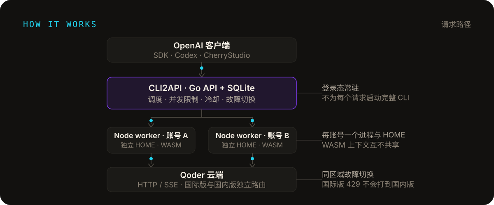
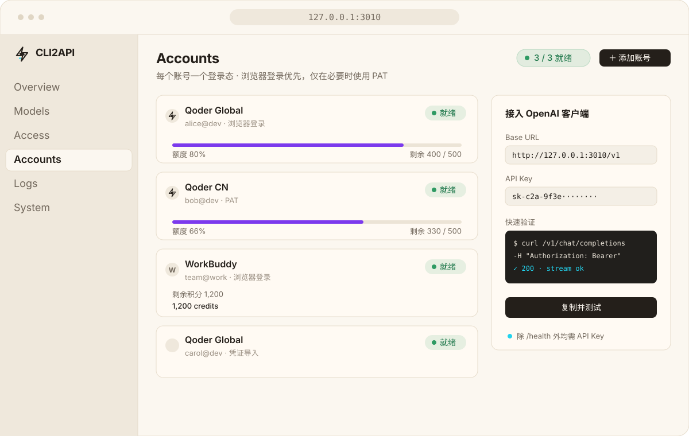

<div align="center">

# CLI2API

**把你自己的登录态，变成一个本机 OpenAI 兼容 API**

支持 **Qoder 国际版**、**Qoder 国内版**、**WorkBuddy 国际版**、**WorkBuddy 国内版** 和 **Trae 国内版 Solo**。

常驻 worker、多账号调度，Docker 一键启动。

[](LICENSE)
[](https://linux.do)

<sub>[English](README_EN.md) · [问题反馈](https://github.com/caigee-cmd/cli2api/issues) · [LINUX DO](https://linux.do)</sub>



</div>



## 功能

- **OpenAI / Anthropic 兼容代理**：`/v1/chat/completions`、`/v1/responses`、`/v1/messages`、`/v1/models`；支持流式/非流式、文本、图片与函数工具调用；文件输入会明确拒绝。`messages` / `responses` 当前为无状态适配层，不支持服务端会话或上游专属工具。
- **多渠道账号池**：Qoder 国际版 / 国内版、WorkBuddy 国际版 / 国内版、Trae 国内版 Solo；地域隔离、账号固定、并发限制、冷却与同族故障切换
- **常驻热 worker**：每账号独立 Node 进程与运行目录，鉴权、WASM 编码和云端 SSE 连接保持热；预热后小对话延迟约 1-2 秒，按请求拉起 CLI 的方案通常要 10 秒以上
- **多种登录方式**：浏览器 Device Flow OAuth、PAT、`qoder-native-v1` 凭证导入/导出
- **Web 控制台**：账号、模型、接入、请求历史与运行时日志，明暗主题
- **部署与运维**：Docker Compose 单容器、安全托管更新（升级前快照、失败自动回滚、逐版本升级）、默认只监听 `127.0.0.1`
- **跨平台**：`linux/amd64` / `linux/arm64` 镜像；macOS、Windows 通过 Docker Desktop 运行

## 快速开始

依赖：Docker（macOS / Windows 用 Docker Desktop，Linux 用 Docker Engine + Compose），以及一个你自己控制的 Qoder、WorkBuddy 或 Trae 账号。Windows 的 Docker Desktop 必须切换到 Linux containers。

```bash
git clone https://github.com/caigee-cmd/cli2api.git
cd cli2api
./scripts/start.sh        # Windows 用 scripts\start.ps1
```

首次启动会生成随机 API Key 并在日志中打印一次，请先保存；打开 `http://127.0.0.1:3010` 登录控制台，在 **Accounts** 页面添加账号。详细步骤见 [部署说明](deploy/README.md)。

## 接入客户端

任何支持 OpenAI 兼容 API 的客户端（OpenAI SDK、Codex、CherryStudio 等）都可以直接接入：

```text
Base URL: http://127.0.0.1:3010/v1
API Key:  <首次启动时生成的 Key>
```

不指定账号时，调度器自动选择可用账号；需要固定账号时加请求头 `X-Qoder-Account: acc_...`。除 Chat Completions 外，也可使用 Anthropic `POST /v1/messages` 与 OpenAI `POST /v1/responses`；两者要求请求携带完整对话，不支持 `previous_response_id` / `conversation` 服务端续接。curl / PowerShell 示例见 [部署说明](deploy/README.md)。

## 工作方式

<p align="center">
  
</p>

每个启用账号拥有独立的 Node 进程和运行目录，避免共享 Qoder WASM 上下文。Go 负责账号持久化、调度、并发限制、冷却、失败切换和子进程生命周期。

## 控制台

<p align="center">
  
</p>

账号、模型、接入和日志都在同一个 Web 控制台里管理：每个账号独立登录（浏览器 OAuth、PAT 或凭证导入），就绪状态和额度一目了然，Access 页可以直接复制 Base URL 并做一次快速验证。

## 适合什么场景

- 想在本机或私有服务器上统一接入 Qoder / WorkBuddy / Trae
- 已经在使用 OpenAI API 格式的客户端或脚本
- 需要在多个账号之间自动路由和故障切换
- 想保留登录能力，同时避免每个请求启动完整 CLI Agent

CLI2API 是本地网关：不提供账号、额度或官方 API 服务，不做多用户共享转售。

## Roadmap

**进行中**

- Qoder 国内版与 WorkBuddy 的真账号验收（登录、故障切换、混合账号池）
**已支持**

- Anthropic `/v1/messages` 与 OpenAI `/v1/responses` 的无状态文本 / 函数工具适配层
- WorkBuddy 每日签到与 token 保活（账号级开关，默认关闭；控制台可立即签到 / 刷新积分）

**规划中**

- 会话粘性路由：同一会话优先复用同一账号，提升上游缓存命中率
- 请求历史增强：按账号过滤与用量统计

**长期**

- 更多上游渠道（Cursor 等）
- 可选的提示词 / 回复留档（显式开关，默认关闭）

## 文档

- [部署与运维：启动步骤、环境变量、接口、托管更新](deploy/README.md)
- [变更记录](CHANGELOG.md)

## 安全

默认只监听 `127.0.0.1:3010`，全接口需要 API Key。不要提交 `.qoder`、Token、Cookie、登录 Blob 或原始抓包；凭证导出是显式敏感操作，请妥善保管导出文件。上游 API 或 CLI 更新可能导致兼容性变化，项目会固定并检查 qodercli 版本。发现安全问题请按 [SECURITY.md](SECURITY.md) 私下报告。

## 社区

中文讨论见 [LINUX DO](https://linux.do)。缺陷和功能请求请继续走 GitHub [Issue](https://github.com/caigee-cmd/cli2api/issues)。

## 贡献

欢迎提交 Issue、改进文档和 Pull Request，规则见 [CONTRIBUTING.md](CONTRIBUTING.md)。

## 许可证

[MIT](LICENSE) — 仅供个人学习使用，请遵守各上游平台服务条款。
