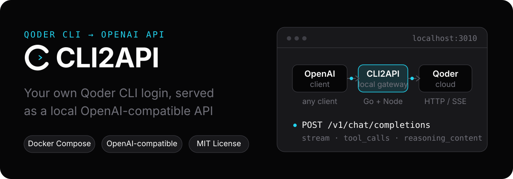
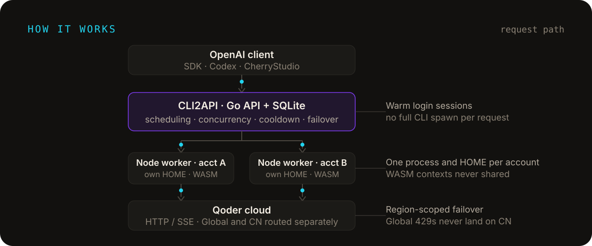
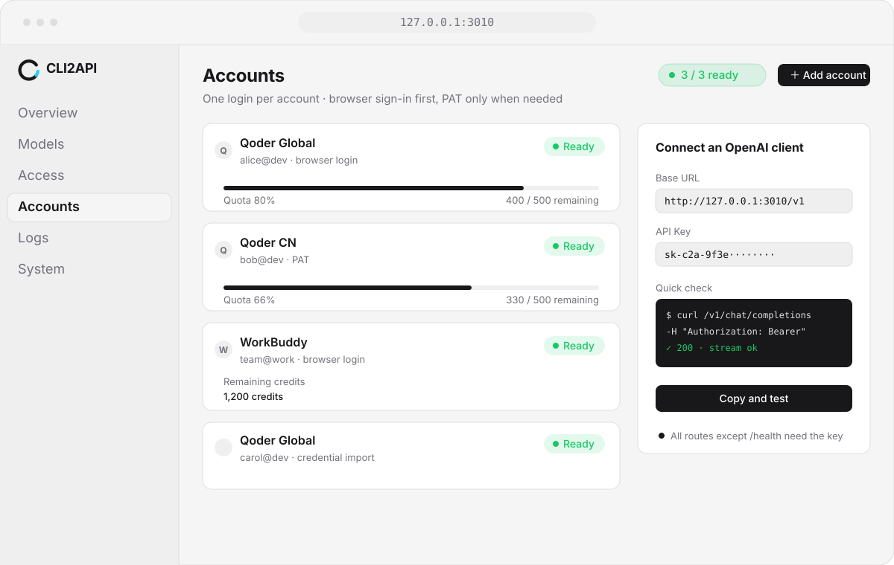

<div align="center">

# CLI2API

**Turn your own logins into a local OpenAI-compatible API**

Supports **Qoder Global**, **Qoder CN**, **WorkBuddy Global**, **WorkBuddy CN**, and **Trae CN Solo**.

Long-lived account runtimes, multi-account scheduling. Deploy with Docker; that is the supported install and update path.

[](LICENSE)
[](https://linux.do)

<sub>[中文](README.md) · [Issues](https://github.com/caigee-cmd/cli2api/issues) · [LINUX DO](https://linux.do)</sub>



</div>

## Features

- **OpenAI / Anthropic-compatible proxy**: `/v1/chat/completions`, `/v1/responses`, `/v1/messages`, `/v1/models` — streaming/non-streaming text and function tools; image support depends on the provider (currently supported by Qoder, not WorkBuddy / Trae); file inputs are rejected explicitly. `messages` / `responses` are stateless adapters today and do not support server-side conversations or upstream-specific tools.
- **Multi-channel account pool**: Qoder Global / Qoder CN, WorkBuddy Global / WorkBuddy CN, Trae CN Solo — region isolation, account pinning, concurrency limits, cooldowns, and same-family failover
- **Account-level runtimes**: Qoder accounts use an isolated Node process, HOME, and WASM context; WorkBuddy / Trae use in-process HTTP/SSE adapters. Each provider owns its login and upstream runtime boundary
- **Provider-specific login methods**: browser Device Flow OAuth, PAT, and credential import/export where supported
- **Web console**: accounts, models, access, request history, and runtime logs, with light and dark themes
- **Deployment and ops**: single Docker Compose container, safe managed updates (pre-update snapshot, automatic rollback on failure, next-version-only upgrades), binds `127.0.0.1` by default
- **Cross-platform**: `linux/amd64` / `linux/arm64` images; macOS and Windows run them through Docker Desktop

## Quick start

**Deploy with Docker.** Published images and console managed updates (pre-update snapshot, automatic rollback, next-version upgrades) are built around the single Compose container. Running the Go / Node sources directly is not on that update path.

Requirements: Docker (Docker Desktop on macOS/Windows, Docker Engine + Compose on Linux) and a Qoder, WorkBuddy, or Trae account you control. On Windows, Docker Desktop must use Linux containers.

```bash
git clone https://github.com/caigee-cmd/cli2api.git
cd cli2api
./scripts/start.sh        # Windows: scripts\start.ps1
```

The first startup generates a random API key and prints it once in the logs — save it. Then open `http://127.0.0.1:3010`, sign in, and add accounts from **Accounts**. Full steps in the [deployment guide](deploy/README.md).

## Connect a client

Any OpenAI-compatible client (OpenAI SDKs, Codex, CherryStudio, …) works out of the box:

```text
Base URL: http://127.0.0.1:3010/v1
API Key:  <the key printed on first startup>
```

Without an account header the scheduler picks a ready account; pin a request with the `X-Qoder-Account: acc_...` header (a historical name that applies to every provider). Anthropic `POST /v1/messages` and OpenAI `POST /v1/responses` are also available; both require the complete conversation in each request and do not support server-side continuation through `previous_response_id` / `conversation`. Use `X-CLI2API-Session` when session-sticky routing is desired. curl / PowerShell examples in the [deployment guide](deploy/README.md).

## How it works

<p align="center">
  
</p>

Each enabled account gets an isolated runtime: Qoder uses its own Node process, HOME, and WASM context, while WorkBuddy / Trae use in-process adapters. Go owns persistence, scheduling, concurrency limits, cooldowns, failover, and the lifecycle of providers that need child processes.

## Console

<p align="center">
  
</p>

Accounts, models, access, and logs all live in one web console. Each account signs in through the methods supported by its provider (browser OAuth, PAT, or credential import), readiness and quota are visible at a glance, and the Access page lets you copy the Base URL and run a quick check.

## Use cases

- Connect Qoder / WorkBuddy / Trae to local or private-server tooling
- Reuse OpenAI-compatible clients and scripts
- Route requests across multiple accounts with failover
- Keep login state available without starting a full CLI Agent per request

CLI2API is a local gateway: it does not provide accounts, quotas, or an official API service, and it is not a shared multi-user resale service.

## Roadmap

**In progress**

- Live-account acceptance for Qoder CN and WorkBuddy (login, failover, mixed account pools)

**Supported**

- Stateless text and function-tool adapters for Anthropic `/v1/messages` and OpenAI `/v1/responses`; image input where the provider supports it
- WorkBuddy daily check-in and token keepalive (per-account opt-in, off by default; console can check in now / refresh credits)
- Session-sticky routing via `X-CLI2API-Session`, with rule-based failover when the bound account cannot serve the request
- Request history filtering by account, plus request status, latency, token, and usage statistics

**Longer term**

- More upstream channels (Cursor, etc.)
- Optional prompt/completion capture behind an explicit switch (off by default)

## Documentation

- [Deployment and operations: setup steps, environment variables, endpoints, managed updates](deploy/README.md)
- [Changelog](CHANGELOG.md)

## Security

The service binds `127.0.0.1:3010` by default; all APIs and console data endpoints require the API key except `/health` and static frontend assets. Never commit `.qoder`, tokens, cookies, auth blobs, or raw captures; credential export is an explicit sensitive operation — protect exported files. Upstream API or CLI changes may affect compatibility; qodercli is pinned and checked. Please report security issues privately according to [SECURITY.md](SECURITY.md).

## Community

Chinese-language discussion is on [LINUX DO](https://linux.do). Bugs and feature requests still go to GitHub [Issues](https://github.com/caigee-cmd/cli2api/issues).

## Contributing

Issues, documentation improvements, and pull requests are welcome — see [CONTRIBUTING.md](CONTRIBUTING.md).

## License

[MIT](LICENSE) — for personal learning use; please follow the terms of each upstream platform.
