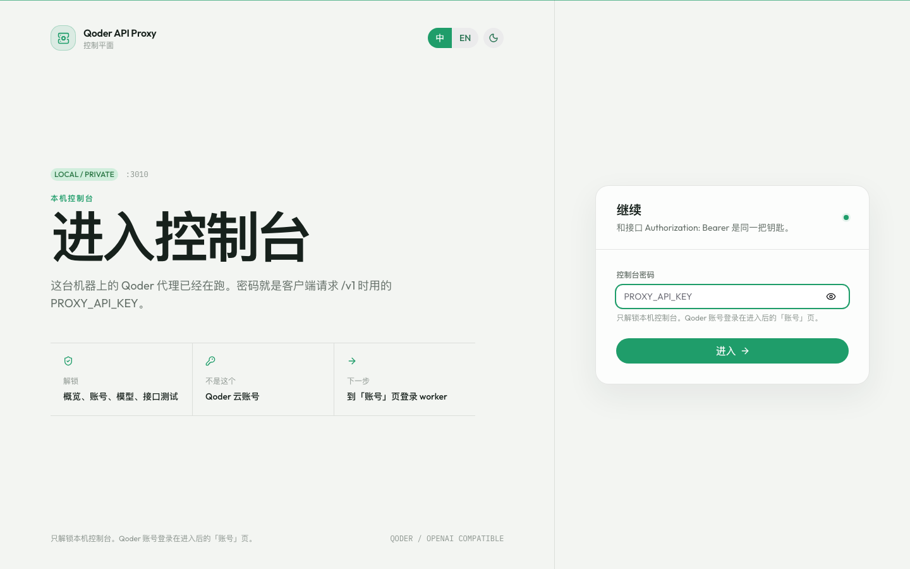

# CLI2API

[English](README.md) · [问题反馈](https://github.com/caigee-cmd/cli2api/issues) · [贡献指南](CONTRIBUTING.md)

[](https://github.com/caigee-cmd/cli2api/actions/workflows/ci.yml)
[](https://github.com/caigee-cmd/cli2api/pkgs/container/cli2api)
[](LICENSE)

把你自己的 **Qoder CLI 登录态**，变成一个本机运行的 OpenAI 兼容 API。

CLI2API 是一个非官方、自托管的 Qoder API 网关。启动以后，你可以继续使用熟悉的 OpenAI SDK、Codex、CherryStudio 等客户端，只需要把 Base URL 指向本机服务。



> [!IMPORTANT]
> CLI2API 与 Qoder 官方无关联，也未获得官方背书。请只使用你有权使用的账号，并遵守 Qoder 及相关服务条款。

## 你会得到什么

- 一个兼容 OpenAI Chat Completions 的本地接口：`/v1/chat/completions`
- 支持流式输出、非流式输出、工具调用和 `reasoning_content`
- 一个可以管理 Qoder 账号、模型和接口测试的 Web 控制台
- 多账号路由、账号固定、并发限制、冷却和故障切换
- 一个适合个人开发、家庭实验室和私有部署的 Docker Compose 服务

它不会为每个请求启动完整的 Qoder CLI Agent，而是让鉴权、WASM 编码和 Qoder 云端 HTTP/SSE 连接保持在常驻 worker 中。

## 先跑起来

依赖：macOS / Windows 使用 Docker Desktop，Linux 使用 Docker Engine + Compose；另外需要一个你自己控制的 Qoder 账号。Windows 的 Docker Desktop 必须切换到 Linux containers。

macOS / Linux：

```bash
git clone https://github.com/caigee-cmd/cli2api.git
cd cli2api
./scripts/start.sh
```

Windows PowerShell：

```powershell
git clone https://github.com/caigee-cmd/cli2api.git
Set-Location cli2api
powershell -ExecutionPolicy Bypass -File .\scripts\start.ps1
```

启动脚本会自动创建 `deploy/.env`，优先启动已发布镜像；镜像不可用时会自动从源码构建。

首次启动时，服务会生成一个随机 API Key，保存到 SQLite，并在日志中打印一次。请先保存它：

```bash
docker compose --env-file deploy/.env -f deploy/docker-compose.yml logs qoder-api-proxy
```

然后打开 `http://127.0.0.1:3010`，使用这个 Key 登录控制台，在 **Accounts** 页面添加 Qoder 账号。

默认只监听本机地址 `127.0.0.1:3010`，不会直接暴露到公网。

## 页面安全更新

先启动一次 CLI2API，再安装可选的本机更新器。

| 宿主机 | 主程序运行方式 | 本机更新器 |
|--------|----------------|------------|
| Linux `amd64` / `arm64` | 对应架构的 Linux Docker 镜像 | systemd + Unix Socket |
| macOS Intel / Apple Silicon | Docker Desktop Linux 容器 | 当前用户 LaunchAgent |
| Windows `amd64` / `arm64` | Docker Desktop Linux 容器 | 当前用户计划任务 |

主 API 服务始终运行在 Linux 容器中，不发布 macOS / Windows 原生主程序。发布镜像同时支持 `linux/amd64` 和 `linux/arm64`；每个 Release 还会附带 6 个平台/架构 updater 与 `cli2api-updater_checksums.txt`。

安装器优先下载并校验预编译 updater。Linux 会先复用当前容器中架构匹配的 updater；如果旧版本没有发布资产，则尝试最新且协议兼容的资产，最后才回退到本机 Go `1.25.6+` 编译。

macOS + Docker Desktop：

```bash
./deploy/install-updater.sh
docker compose --env-file deploy/.env -f deploy/docker-compose.yml up -d --force-recreate qoder-api-proxy
```

Linux + systemd：

```bash
sudo ./deploy/install-updater.sh
docker compose --env-file deploy/.env -f deploy/docker-compose.yml up -d --force-recreate qoder-api-proxy
```

Windows + Docker Desktop，请使用当前运行 Docker Desktop 的登录用户打开 PowerShell：

```powershell
powershell -ExecutionPolicy Bypass -File .\deploy\install-updater.ps1
docker compose --env-file deploy\.env -f deploy\docker-compose.yml up -d --force-recreate qoder-api-proxy
```

Linux 使用私有 Unix Socket。macOS 使用当前用户的 LaunchAgent，Windows 使用当前用户的计划任务；两个 Docker Desktop 平台都通过强令牌访问仅监听 `127.0.0.1` 的 updater。若 `qoder-api-proxy` 已存在，Windows 安装器还会验证容器能否通过 `host.docker.internal` 访问 updater。

安装后，控制台 **系统更新** 页面只允许更新到紧邻的下一个稳定版本，不接受自定义版本、跳版本或预发布版本。更新前会暂停新请求、等待在途请求结束，并在 `/data/backups` 创建经过完整性校验的 SQLite 快照。

更新过程只重建 `qoder-api-proxy`，不会执行 `docker compose down -v`，也不会删除 `qoder-data`。如果新版健康检查失败，会同时恢复旧镜像和更新前的 SQLite 快照，并把 `CLI2API_IMAGE` 固定回旧版本，避免以后重启时再次进入失败版本。默认保留最近 5 份快照。

## 维护者一键发布

确认 `main` 的 CI 已通过后，只需要执行：

```bash
gh workflow run release.yml --ref main
```

工作流会先等待当前 `main` 提交的 CI 通过，再根据最新已发布稳定版本自动增加 patch 版本；它会创建不可见的 Draft Release，构建并校验 6 个 updater，验证 `linux/amd64` 与 `linux/arm64` 镜像，全部完成后才正式发布 GitHub Release 并移动稳定镜像别名。不要再手动创建或推送版本 Tag。

也可以进入 **Actions → Release → Run workflow** 点击发布。如果正式发布前失败，直接在同一次运行中选择 **Re-run failed jobs**；Draft Release 不会被应用的更新检查发现。

## 接入 OpenAI 客户端

客户端配置如下：

```text
Base URL: http://127.0.0.1:3010/v1
API Key:  <首次启动时生成的 Key>
```

也可以直接发送一个请求：

```bash
export CLI2API_API_KEY='粘贴首次启动时输出的密钥'

curl http://127.0.0.1:3010/v1/chat/completions \
  -H "Authorization: Bearer $CLI2API_API_KEY" \
  -H "Content-Type: application/json" \
  -d '{
    "model": "qwen3.7-plus",
    "messages": [{"role": "user", "content": "只回复 OK"}],
    "stream": false
  }'
```

PowerShell 等价写法：

```powershell
$env:CLI2API_API_KEY = "粘贴首次启动时输出的密钥"
$Headers = @{ Authorization = "Bearer $env:CLI2API_API_KEY" }
$Body = @{
  model = "qwen3.7-plus"
  messages = @(@{ role = "user"; content = "只回复 OK" })
  stream = $false
} | ConvertTo-Json -Depth 4
Invoke-RestMethod -Method Post -Uri "http://127.0.0.1:3010/v1/chat/completions" -Headers $Headers -ContentType "application/json" -Body $Body
```

不指定账号时，调度器会从可用账号中选择一个。需要固定账号时，添加请求头：

```text
X-Qoder-Account: acc_...
```

## 适合什么场景

- 想在本机或私有服务器上统一接入 Qoder
- 已经在使用 OpenAI API 格式的客户端或脚本
- 需要在多个 Qoder 账号之间自动路由和故障切换
- 想保留 Qoder 登录能力，同时避免每个请求启动完整 CLI Agent

目前上游只支持 Qoder。CLI2API 是本地代理，不提供账号、额度或官方 API 服务。

## 工作方式

```text
OpenAI 客户端
  -> Go API + SQLite 账号控制面
    -> 每个 Qoder 账号一个隔离 Node worker
      -> Qoder 云端 HTTP/SSE API
```

每个启用账号拥有独立的 Node 进程和运行目录，避免共享 Qoder WASM 上下文。Go 负责账号持久化、调度、并发限制、冷却、失败切换和子进程生命周期。

## 支持的功能

- 浏览器 Device Flow OAuth、PAT、`qoder-native-v1` 凭证导入/导出
- OpenAI 兼容的 `GET /v1/models`
- 流式和非流式响应
- Tool calls 与 `reasoning_content`
- 多 Qoder 账号、账号固定、调度、冷却和故障切换
- React + Tailwind + HeroUI 控制台，支持明暗主题
- SQLite 持久化账号凭证，账号运行目录临时化
- GitHub Actions 自动测试、构建容器和发布 GHCR 镜像

## 配置

| 变量 | 默认值 | 说明 |
|------|--------|------|
| `QODER_DATA_DIR` | `/data` | SQLite 数据库和持久化账号凭证 |
| `QODER_RUNTIME_DIR` | `/run/cli2api` | 临时的账号 Qoder 运行目录 |
| `QODER_MAX_INFLIGHT` | `4` | 单账号最大并发请求数 |
| `QODER_WORKER_BASE_PORT` | `32100` | 内部 worker 端口起点 |
| `UPDATE_GITHUB_TOKEN` | 空 | 可选的 GitHub Release 查询 Token |
| `UPDATE_AGENT_URL` | 空 | Docker Desktop 本机 updater 地址，由安装器写入 |
| `UPDATE_AGENT_TOKEN` | 空 | Docker Desktop updater 令牌，由安装器写入 |
| `CLI2API_UPDATER_SOCKET_DIR` | 按平台设置 | 只读挂载 Linux updater Socket 的宿主机目录 |

API Key 首次生成后只保存在 SQLite 中。服务不再支持通过环境变量设置或轮换 API Key。

## 接口

| 方法 | 路径 | 说明 |
|------|--------|------|
| `GET` | `/health` | 健康检查，不需要 API Key |
| `GET` | `/v1/models` | 模型列表 |
| `POST` | `/v1/chat/completions` | OpenAI 兼容对话接口 |
| `GET/POST` | `/api/*` | 控制台管理接口 |

除 `/health` 外，控制台和 API 都需要 SQLite 中保存的 API Key。

## 从源码开发

环境要求：Go `1.25.6+`、Node.js `20+`、npm，以及容器开发所需的 Docker。

```bash
# Go API
go test ./...
go vet ./...

# Qoder worker
cd worker
npm test

# 控制台
cd ../frontend
npm ci
npm run build
npm run lint
```

修改前端后运行 `npm run sync`，将构建结果同步到 Go 的嵌入静态资源中：

```bash
cd frontend
npm run sync
```

从源码构建并启动容器：

```bash
cd deploy
docker compose up -d --build
```

更多仓库规则和验证命令见 [CONTRIBUTING.md](CONTRIBUTING.md)。

## 文档

- [架构、登录、路由和控制台设计](docs/DESIGN.md)
- [当前里程碑与开发计划](docs/PLAN.md)
- [Docker Compose 部署说明](deploy/README.md)
- [变更记录](CHANGELOG.md)
- [安全问题报告](SECURITY.md)

## 安全与隐私

- 不要在没有 API Key 保护的情况下暴露服务。
- 不要提交 `.qoder`、Token、Cookie、登录 Blob、原始抓包或主机信息。
- 账号凭证导出是显式敏感操作，请妥善保管导出文件。
- 上游 API 或 Qoder CLI 更新可能导致兼容性变化；项目会固定并检查 qodercli 版本。
- 发现安全问题请不要直接公开 Issue，按 [SECURITY.md](SECURITY.md) 的方式私下报告。

## 贡献

欢迎提交 Issue、改进文档和 Pull Request。提交前请确认：

- 变更范围清晰，未引入新的组件库或不必要的服务依赖。
- 已运行与改动相关的测试和构建命令。
- Diff 中不包含 Token、登录态、原始协议抓包或真实部署信息。

详见 [CONTRIBUTING.md](CONTRIBUTING.md)。

## 许可证

[MIT](LICENSE)
